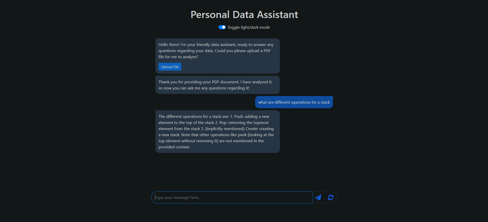

# Personal Data Assistant

This project is a personal data assistant that can process user messages and PDF documents to provide relevant responses according to the uploaded PDF. It uses Flask for the backend, a JavaScript frontend, and various machine learning models for natural language processing. It provides relevant text responses using the concept of RAG.

## Table of Contents

- [Installation](#installation)
- [Usage](#usage)
- [Project Structure](#project-structure)
- [Dependencies](#dependencies)
- [Technologies Used](#technologies-used)
- [Demo](#demo)
- [License](#license)

## Installation

1. Clone the repository:
    ```sh
    git clone https://github.com/hassan2-aamir/personal-data-assistant.git
    cd personal-data-assistant
    ```

2. Build the Docker image:
    ```sh
    docker build -t personal-data-assistant .
    ```

3. Run the Docker container:
    ```sh
    docker run -p 8000:8000 personal-data-assistant
    ```

## Usage

1. Open your web browser and navigate to `http://localhost:8000`.
2. Interact with the chatbot by typing messages or uploading PDF documents.
3. Use the light/dark mode toggle switch to change the theme.

## Project Structure

```
.
├── Dockerfile
├── README.md
├── requirements.txt
├── server.py
├── server_huggingface.py
├── static
│   ├── script.js
│   └── style.css
├── templates
│   └── index.html
├── worker.py
└── worker_huggingFace.py
```

- `Dockerfile`: Docker configuration for building the project.
- `requirements.txt`: Python dependencies.
- `server.py`: Flask server for handling requests.
- `server_huggingface.py`: Alternative Flask server using HuggingFace models.
- `static/`: Contains static files like JavaScript and CSS.
- `templates/`: Contains HTML templates.
- `worker.py`: Worker module for processing user prompts and documents.
- `worker_huggingFace.py`: Alternative worker module using HuggingFace models.

## Dependencies

- Flask==3.1.0
- Flask_Cors==5.0.0
- pdf2image==1.17.0
- chromadb==0.4.24
- pypdf==5.2.0
- tiktoken==0.8.0
- ibm-watsonx-ai==1.1.20
- langchain-ibm==0.3.4
- langchain==0.3.7
- pydantic==2.10.1
- pandas==1.5
- atlassian-python-api==3.36.0
- huggingface-hub==0.16.4
- torch==2.0.1
- sentence-transformers==2.2.2
- InstructorEmbedding==1.0.0
- p4python==2023.1.2454917
- lxml==4.9.2
- bs4==0.0.1
- langchain_community

## Technologies Used

- **Backend**: Flask
- **Frontend**: JavaScript, HTML, CSS
- **Machine Learning**: HuggingFace models, IBM Watson AI
- **Containerization**: Docker
- **PDF Processing**: pdf2image, pypdf
- **Data Handling**: pandas
- **NLP**: sentence-transformers, InstructorEmbedding

## Demo

Here are some screenshots of the application in action:


*Initial chat interface prompting to upload a document*


*AI answering questions based on the uploaded document*

## License

This project is licensed under the MIT License.
